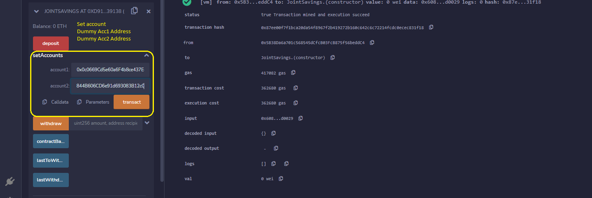

# Unit 20 - "Joint Savings Account"

## Assignment 
---

A fintech startup company is disrupting the finance industry with its own cross-border, Ethereum-compatible blockchain that connects financial institutions. Currently, the team is building smart contracts to automate many of the institutions’ financial processes and features, such as hosting joint savings accounts.

To automate the creation of joint savings accounts, I had to  create a Solidity smart contract that accepts two user addresses. These addresses will be able to control a joint savings account. The smart contract will use ether management functions to implement a financial institution’s requirements for providing the features of the joint savings account. These features will consist of the ability to deposit and withdraw funds from the account.

##

* The completed Solidity `JointSavings` smart contract.

* A folder named `Execution_Results` that contains at least eight images. These images should confirm that the deposit and withdrawal transactions, which are designed to test the `JointSavings` functionality in the JavaScript VM, worked as expected.

## Requirements
---

### `Steps for this assignment`

1. Create a Joint Savings Account Contract in Solidity

2. Compile and Deploy the contract

3. Interact with Deployed Smart Contract

## Step 1: Create a Joint Savings Account Contract in Solidity
---

1. Open the Solidity file named `joint_savings.sol` in the Remix IDE.

2. Define a new contract named `JointSavings`.

3. Define the following variables in the new contract:

    * Two variables of type `address payable` named `accountOne` and `accountTwo`

    * A variable of type `address public` named `lastToWithdraw`

    * Two variables of type `uint public` named `lastWithdrawAmount` and `contractBalance`

4. Define a function named `withdraw` that accepts two arguments: `amount` of type `uint` and `recipient` of type `payable address`. In this function, code the following:

    * Define a `require` statement that checks if `recipient` is equal to either `accountOne` or `accountTwo`. If it isn’t, the `require` statement returns the “You don't own this account!” text.

    * Define a `require` statement that checks if `balance` is sufficient for accomplishing the withdrawal operation. If there are insufficient funds, it returns the “Insufficient funds!” text.

    * Add an `if` statement to check if `lastToWithdraw` is not equal (`!=`) to `recipient`. If it’s not equal, set it to the current value of `recipient`.

    * Call the `transfer` function of the `recipient`, and pass it the `amount` to transfer as an argument.

    * Set `lastWithdrawAmount` equal to `amount`.

    * Set the `contractBalance` variable equal to the balance of the contract by using `address(this).balance` to reflect the new balance of the contract.

5. Define a `public payable` function named `deposit`. In this function, code the following:

    * Set the `contractBalance` variable equal to the balance of the contract by using `address(this).balance`.

6. Define a `public` function named `setAccounts` that takes two `address payable` arguments, named `account1` and `account2`. In the body of the function, set the values of `accountOne` and `accountTwo` to `account1` and `account2`, respectively.

7. Add a fallback function so that your contract can store ether that’s sent from outside the deposit function.

## Step 2: Compile and Deploy the Contract 
---

## * ` Compiled the smart contract.` 
---

---
---

## * ` Clicked the Deploy button to deploy  smart contract, then confirmation of successfull deployment.`
---

---
---

## Connected Ganache Account
---
---

## Step 3: Interact with Deployed Smart Contract
---

## * ` Used the `setAccounts` function to define the authorized Ethereum address that will be able to withdraw funds from the contract.`

    
---
---

## * ` Tested the deposit functionality of the smart contract by sending the following amounts of ether. After each transaction, I then used the contractBalance function to verify that the funds were added to the contract:
---
---

  ##  * Transaction 1: Send 1 ether as wei.
  
  ---
  ---

  ##  * Transaction 2: Send 10 ether as wei.
  
  ---
  ---

  ##  * Transaction 3: Send 5 ether.
  

   

## Withdraw
 After successfully depositing funds into the contract, I tested the contract’s withdrawal functionality by 
 ### 1. Withdrawing 5 ether into `accountOne` 
 ### 2.Withdrawing 10 ether into `accountTwo`. 
 
 ### `After each transaction, I used the contractBalance function to verify that the funds were withdrawn from your contract.
 ---
 ---
 
 ---
 ---
 
 
 
  ### ! Also, uses the `lastToWithdraw` and `lastWithdrawAmount` functions to verify that the address and amount were correct.
  ---
  ---
  
  ---
  ---
  

---

